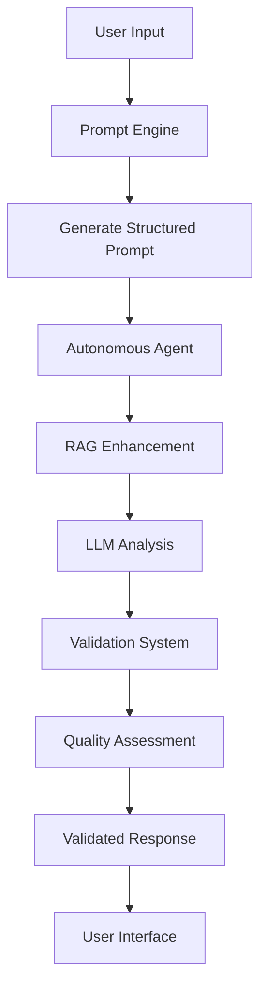

# 🚀 System API Documentation & Integration Flow

## 📋 Overview

This document provides comprehensive documentation for the Prompt Engine system, including all API endpoints, request/response formats, and the complete integration flow between services.

## 🏗️ System Architecture

```
┌─────────────────┐    ┌─────────────────┐    ┌─────────────────┐
│   Prompt Engine │    │ Autonomous Agent│    │ Validation System│
│   (Port 5000)   │    │   (Port 5001)   │    │   (Port 5002)   │
└─────────────────┘    └─────────────────┘    └─────────────────┘
         │                       │                       │
         └───────────────────────┼───────────────────────┘
                                 │
                    ┌─────────────────┐    ┌─────────────────┐
                    │     Ollama      │    │     Qdrant      │
                    │   (Port 11434)  │    │   (Port 6333)   │
                    └─────────────────┘    └─────────────────┘
```

## 🔄 Complete Integration Flow

### 1. **End-to-End Analysis Workflow**



### 2. **Service Interaction Sequence**

1. **User submits financial data** → Prompt Engine
2. **Prompt Engine generates structured prompt** → Autonomous Agent
3. **Autonomous Agent enhances with RAG** → Vector Database (Qdrant)
4. **Autonomous Agent generates analysis** → LLM (Ollama)
5. **Analysis sent for validation** → Validation System
6. **Validation System assesses quality** → LLM (Ollama)
7. **Validated response returned** → User Interface

---

## 🎯 API Endpoints Documentation

### 1. **Prompt Engine API** (Port 5000)

#### **Health Check**
```http
GET /health
```

**Response:**
```json
{
  "status": "healthy",
  "timestamp": "2024-01-15T10:30:00Z",
  "version": "1.0.0"
}
```

#### **Generate Prompt**
```http
POST /generate
```

**Request Payload:**
```json
{
  "input_data": {
    "transactions": [
      {
        "date": "2024-01-15",
        "amount": 1500.00,
        "type": "credit",
        "description": "Salary"
      },
      {
        "date": "2024-01-16", 
        "amount": -50.00,
        "type": "debit",
        "description": "Grocery"
      }
    ],
    "account_balance": 2250.00,
    "customer_id": "CUST_001"
  },
  "template_type": "banking",
  "generation_type": "autonomous"
}
```

**Response:**
```json
{
  "prompt": "Analyze the following financial data and provide insights...",
  "response": "Based on the transaction data...",
  "tokens_used": 1250,
  "processing_time": 2.45,
  "template_used": "banking",
  "generation_mode": "autonomous"
}
```

#### **System Status**
```http
GET /system/status
```

**Response:**
```json
{
  "status": "operational",
  "services": {
    "llm_connected": true,
    "vector_connected": true,
    "rag_initialized": true
  },
  "statistics": {
    "total_requests": 1250,
    "avg_response_time": 2.1
  }
}
```

---

### 2. **Autonomous Agent API** (Port 5001)

#### **Agent Status**
```http
GET /agent/status
```

**Response:**
```json
{
  "status": "healthy",
  "agent_name": "AutonomousFinancialAgent",
  "version": "1.0.0",
  "capabilities": {
    "financial_analysis": true,
    "rag_enhanced_analysis": true,
    "vector_operations": true,
    "prompt_integration": true
  },
  "statistics": {
    "total_analyses": 500,
    "avg_processing_time": 15.2
  }
}
```

#### **Analyze Financial Data**
```http
POST /analyze
```

**Request Payload:**
```json
{
  "input_data": {
    "transactions": [
      {
        "date": "2024-01-15",
        "amount": 1500.00,
        "type": "credit",
        "description": "Salary"
      }
    ],
    "account_balance": 2250.00,
    "customer_id": "CUST_001"
  },
  "request_config": {
    "generation_type": "autonomous",
    "include_validation": true,
    "analysis_depth": "comprehensive"
  }
}
```

**Response:**
```json
{
  "analysis": "=== SECTION 1: INSIGHTS ===\nBased on the transaction analysis...\n=== SECTION 2: RECOMMENDATIONS ===\nI recommend the following actions...",
  "metadata": {
    "processing_time": 12.5,
    "rag_items_found": 3,
    "confidence_score": 0.85
  },
  "validation_result": {
    "overall_score": 0.87,
    "quality_level": "high_quality",
    "quality_approved": true,
    "validation_status": "approved",
    "criteria_scores": {
      "accuracy": 0.9,
      "completeness": 0.85,
      "clarity": 0.88,
      "relevance": 0.86
    },
    "validation_time": 3.2
  },
  "timestamp": "2024-01-15T10:30:00Z"
}
```

#### **Receive Validation Feedback**
```http
POST /feedback/validation
```

**Request Payload:**
```json
{
  "validation_result": {
    "overall_score": 0.87,
    "quality_level": "high_quality"
  },
  "response_data": {
    "analysis": "Analysis content..."
  },
  "input_data": {
    "transactions": [...]
  }
}
```

**Response:**
```json
{
  "status": "success",
  "message": "Feedback received and stored",
  "timestamp": "2024-01-15T10:30:00Z"
}
```

---

### 3. **Validation System API** (Port 5002)

#### **Health Check**
```http
GET /health
```

**Response:**
```json
{
  "status": "healthy",
  "service": "validation_system",
  "version": "1.0.0",
  "llm_connected": true,
  "models_available": ["mistral:latest"],
  "timestamp": "2024-01-15T10:30:00Z"
}
```

#### **Validate Response**
```http
POST /validate/response
```

**Request Payload:**
```json
{
  "response_data": {
    "analysis": "=== SECTION 1: INSIGHTS ===\nThis is a comprehensive financial analysis...\n=== SECTION 2: RECOMMENDATIONS ===\nBased on the analysis, I recommend..."
  },
  "input_data": {
    "transactions": [
      {
        "date": "2024-01-15",
        "amount": 1500.00,
        "type": "credit"
      }
    ],
    "account_balance": 2250.00
  }
}
```

**Response:**
```json
{
  "overall_score": 0.87,
  "quality_level": "high_quality",
  "quality_approved": true,
  "validation_status": "approved",
  "criteria_scores": {
    "accuracy": 0.9,
    "completeness": 0.85,
    "clarity": 0.88,
    "relevance": 0.86
  },
  "validation_details": {
    "overall_assessment": "The response demonstrates high quality analysis with clear insights and actionable recommendations.",
    "strengths": [
      "Well-structured sections",
      "Relevant insights",
      "Clear recommendations"
    ],
    "areas_for_improvement": [
      "Could include more specific metrics"
    ]
  },
  "validation_time": 3.2,
  "timestamp": "2024-01-15T10:30:00Z"
}
```

#### **Validation Status**
```http
GET /validation/status
```

**Response:**
```json
{
  "status": "healthy",
  "integration_initialized": true,
  "service_connected": true,
  "blocking_validation": true,
  "statistics": {
    "total_validations": 1250,
    "passed": 1100,
    "failed": 150,
    "avg_time": 2.8
  },
  "health_status": {
    "status": "healthy",
    "response_time": 0.045
  }
}
```

---

### 4. **Ollama LLM API** (Port 11434)

#### **List Models**
```http
GET /api/tags
```

**Response:**
```json
{
  "models": [
    {
      "name": "mistral:latest",
      "size": 4100000000,
      "digest": "sha256:abc123...",
      "modified_at": "2024-01-15T10:00:00Z"
    }
  ]
}
```

#### **Generate Text**
```http
POST /api/generate
```

**Request Payload:**
```json
{
  "model": "mistral:latest",
  "prompt": "Analyze this financial data and provide insights...",
  "options": {
    "temperature": 0.1,
    "num_predict": 500,
    "top_p": 0.9
  },
  "keep_alive": "5m",
  "stream": false
}
```

**Response:**
```json
{
  "model": "mistral:latest",
  "created_at": "2024-01-15T10:30:00Z",
  "response": "Based on the financial data provided...",
  "done": true,
  "context": [1, 2, 3],
  "total_duration": 2500000000,
  "load_duration": 1000000000,
  "prompt_eval_count": 25,
  "prompt_eval_duration": 500000000,
  "eval_count": 100,
  "eval_duration": 1000000000
}
```

---

### 5. **Qdrant Vector DB API** (Port 6333)

#### **List Collections**
```http
GET /collections
```

**Response:**
```json
{
  "result": {
    "collections": [
      {
        "name": "financial_knowledge",
        "status": "green",
        "optimizer_status": "ok",
        "vectors_count": 10000,
        "indexed_vectors_count": 10000,
        "points_count": 10000,
        "segments_count": 1
      }
    ]
  },
  "status": "ok",
  "time": 0.000123
}
```

#### **Search Vectors**
```http
POST /collections/{collection_name}/points/search
```

**Request Payload:**
```json
{
  "vector": [0.1, 0.2, 0.3, ...],
  "limit": 5,
  "with_payload": true,
  "score_threshold": 0.7
}
```

**Response:**
```json
{
  "result": [
    {
      "id": 123,
      "score": 0.95,
      "payload": {
        "text": "Financial analysis content...",
        "category": "banking"
      }
    }
  ],
  "status": "ok",
  "time": 0.001234
}
```

---

## 🔧 Configuration Details

### **Service Configuration**

#### **Prompt Engine Config** (`config.py`)
```python
FLASK_PORT = 5000
OLLAMA_HOST = "http://localhost:11434"
QDRANT_HOST = "http://localhost:6333"
```

#### **Autonomous Agent Config** (`autonomous-agent/config.py`)
```python
FLASK_PORT = 5001
PROMPT_ENGINE_URL = "http://localhost:5000"
VALIDATION_SYSTEM_URL = "http://localhost:5002"
OLLAMA_HOST = "http://localhost:11434"
QDRANT_HOST = "http://localhost:6333"
```

#### **Validation System Config** (`validation-llm/config.py`)
```python
FLASK_PORT = 5002
OLLAMA_HOST = "http://localhost:11434"
AUTONOMOUS_AGENT_URL = "http://localhost:5001"

VALIDATION_LLM_CONFIG = {
    "primary_validator": {
        "model_name": "mistral:latest",
        "host": "http://localhost:11434",
        "max_tokens": 150,
        "temperature": 0.1,
        "timeout": 30
    },
    "speed_validator": {
        "model_name": "mistral:latest", 
        "host": "http://localhost:11434",
        "max_tokens": 100,
        "temperature": 0.2,
        "timeout": 15
    }
}
```

---

## 🚀 Usage Examples

### **1. Complete Analysis Workflow**

```python
import requests
import json

# Step 1: Generate prompt
prompt_data = {
    "input_data": {
        "transactions": [
            {"date": "2024-01-15", "amount": 1500.00, "type": "credit"},
            {"date": "2024-01-16", "amount": -50.00, "type": "debit"}
        ],
        "account_balance": 2250.00
    },
    "template_type": "banking",
    "generation_type": "autonomous"
}

response = requests.post("http://localhost:5000/generate", json=prompt_data)
prompt_result = response.json()

# Step 2: Run analysis
analysis_data = {
    "input_data": prompt_data["input_data"],
    "request_config": {
        "generation_type": "autonomous",
        "include_validation": True
    }
}

response = requests.post("http://localhost:5001/analyze", json=analysis_data)
analysis_result = response.json()

# Step 3: Check results
print(f"Analysis: {analysis_result['analysis']}")
print(f"Validation Score: {analysis_result['validation_result']['overall_score']:.2%}")
```

### **2. Direct Validation**

```python
validation_data = {
    "response_data": {
        "analysis": "=== SECTION 1: INSIGHTS ===\nGood financial analysis...\n=== SECTION 2: RECOMMENDATIONS ===\nRecommendations here..."
    },
    "input_data": {
        "transactions": [{"date": "2024-01-15", "amount": 1500.00, "type": "credit"}]
    }
}

response = requests.post("http://localhost:5002/validate/response", json=validation_data)
validation_result = response.json()

print(f"Validation Score: {validation_result['overall_score']:.2%}")
print(f"Quality Level: {validation_result['quality_level']}")
```

---

## 🔍 Testing & Monitoring

### **System Health Check**
```bash
# Check all services
curl http://localhost:5000/health  # Prompt Engine
curl http://localhost:5001/agent/status  # Autonomous Agent  
curl http://localhost:5002/health  # Validation System
curl http://localhost:11434/api/tags  # Ollama
curl http://localhost:6333/collections  # Qdrant
```

### **Comprehensive Test**
```bash
python test_system_comprehensive.py
```

### **Performance Monitoring**
- **Response Times**: Monitor API response times
- **Validation Scores**: Track quality metrics
- **Error Rates**: Monitor service failures
- **Resource Usage**: CPU, memory, disk usage

---

## 🛠️ Troubleshooting

### **Common Issues**

1. **Service Connection Refused**
   - Check if service is running
   - Verify port configuration
   - Check firewall settings

2. **Validation Timeout**
   - Check Ollama model availability
   - Verify LLM configuration
   - Monitor system resources

3. **Low Validation Scores**
   - Review validation prompts
   - Check input data quality
   - Verify model responses

4. **Vector DB Issues**
   - Check Qdrant connection
   - Verify collection exists
   - Monitor disk space

### **Debug Commands**
```bash
# Check service logs
docker logs ollama
docker logs qdrant

# Test individual components
curl -X POST http://localhost:11434/api/generate -d '{"model":"mistral:latest","prompt":"test"}'
curl http://localhost:6333/collections
```

---

## 📊 Performance Metrics

### **Expected Response Times**
- **Prompt Generation**: 1-3 seconds
- **Analysis Processing**: 10-30 seconds
- **Validation**: 2-5 seconds
- **End-to-End**: 15-40 seconds

### **Quality Thresholds**
- **Exemplary**: ≥ 95%
- **High Quality**: ≥ 80%
- **Acceptable**: ≥ 65%
- **Poor**: < 65%

### **System Requirements**
- **CPU**: 4+ cores recommended
- **RAM**: 8GB+ recommended
- **Storage**: 10GB+ for models
- **Network**: Stable internet for model downloads

---

## 🎯 Best Practices

1. **Always validate responses** before delivering to users
2. **Monitor validation scores** for quality assurance
3. **Use appropriate timeouts** for long-running operations
4. **Implement retry logic** for transient failures
5. **Log all interactions** for debugging and improvement
6. **Regular health checks** to ensure system availability
7. **Backup configurations** and model data
8. **Monitor resource usage** to prevent bottlenecks

---

## 🔄 System Updates

### **Model Updates**
```bash
# Update Ollama models
ollama pull mistral:latest
ollama pull phi3:3.8b
```

### **Service Restarts**
```bash
# Restart services
docker-compose restart ollama qdrant
# Restart Python services
python server.py  # Prompt Engine
python autonomous-agent/server_final.py  # Agent
python validation-llm/validation_server.py  # Validation
```

---

## 📞 Support & Maintenance

For system support and maintenance:
1. Check service health endpoints
2. Review system logs
3. Run comprehensive tests
4. Monitor performance metrics
5. Update models and dependencies regularly

---

**Last Updated**: 2024-01-15  
**Version**: 1.0.0  
**Status**: Production Ready ✅
